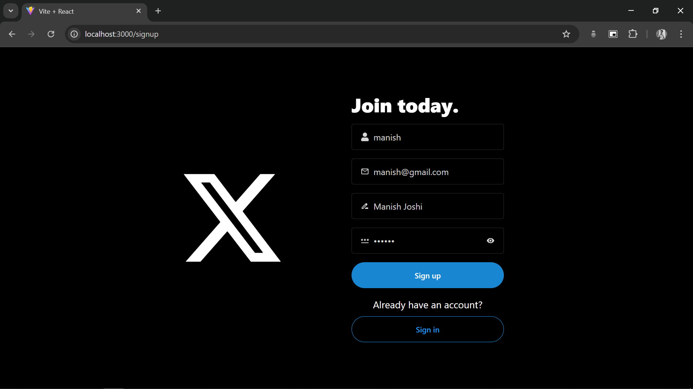
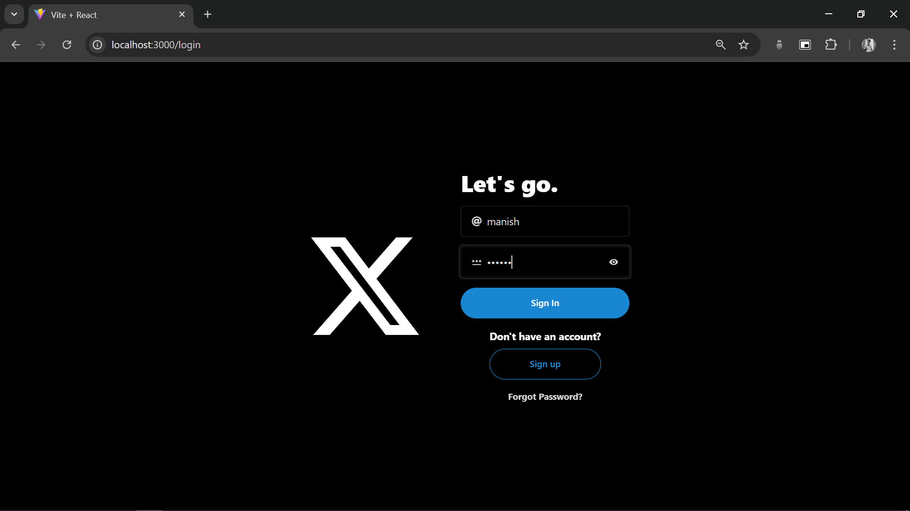
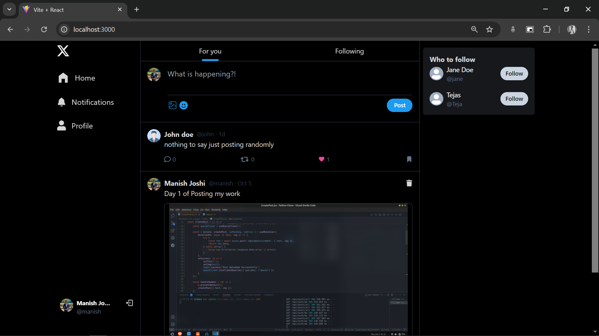
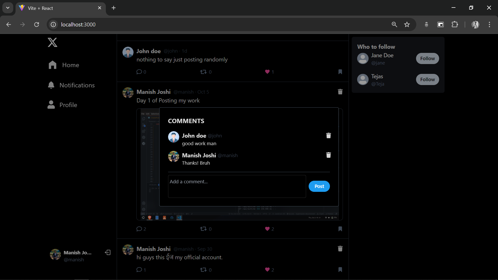
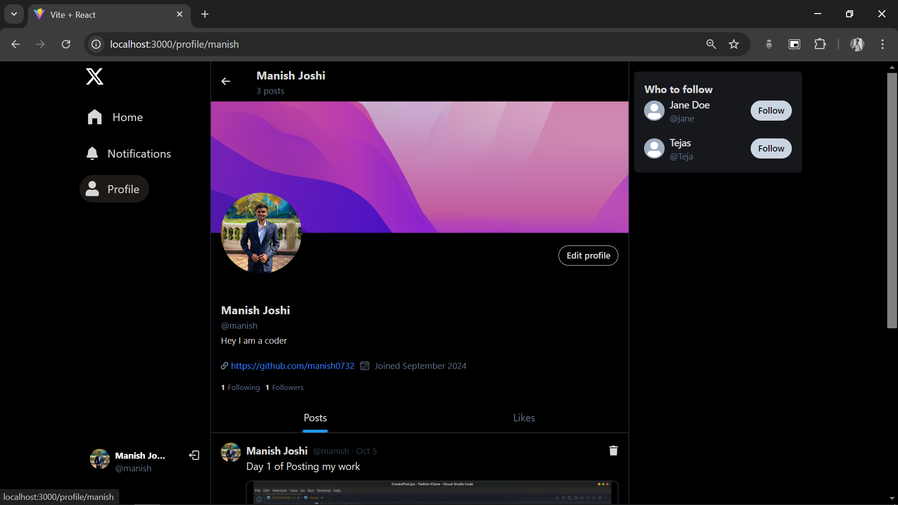
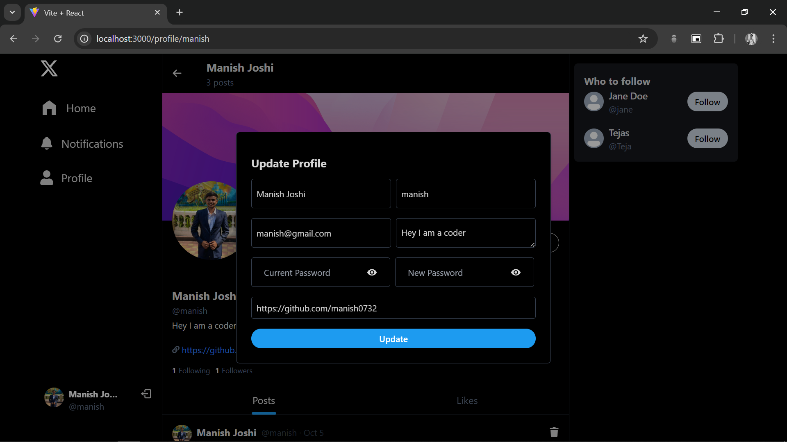
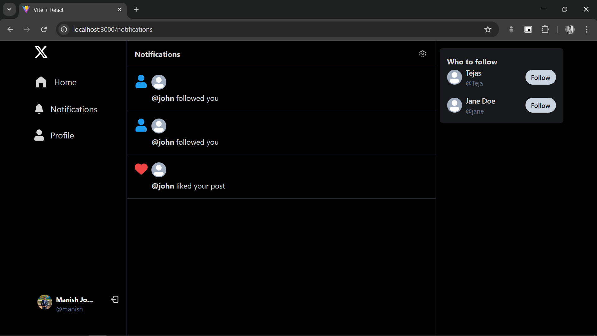
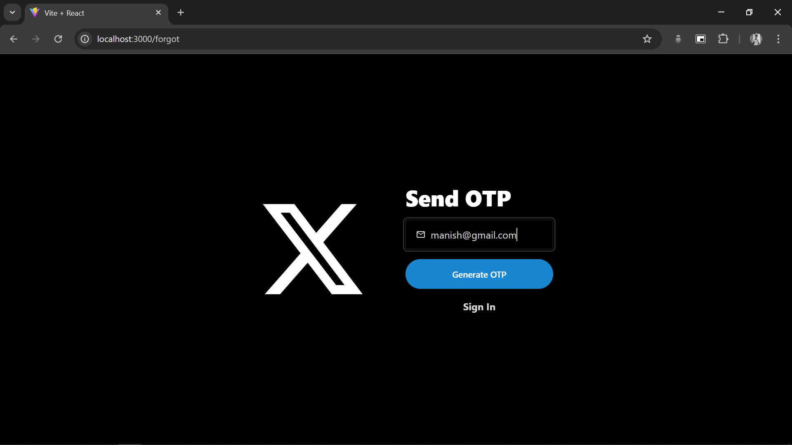
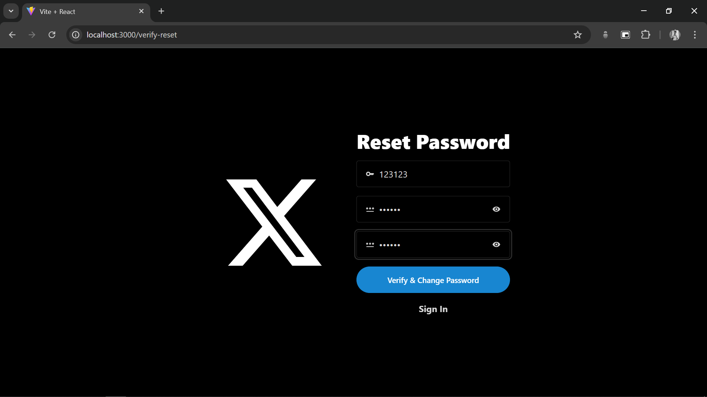

# Twitter Clone

A full-stack Twitter-like web application built using the MERN stack (MongoDB, Express.js, React.js, Node.js). This project simulates the core features of Twitter, including user authentication, posting tweets, commenting, liking, and profile management.

## Features

- User authentication (sign-up, login, JWT-based sessions)
- Create, read, update, and delete posts (tweets)
- Like and comment on posts
- Edit user profiles (bio, profile picture, cover image)
- Real-time updates with WebSockets

## Tech Stack

- **Frontend:** React.js, TailwindCSS, Axios, React-Query(tanstack)
- **Backend:** Node.js, Express.js, Mongoose, JWT
- **Database:** MongoDB

## Live Demo
Check out the live version: [Twitter Clone](https://twitter-clone-tdwg.onrender.com/)  Might take some time to load. 

## Getting Started

### 1. Prerequisites

- **Node.js and npm:** Make sure you have Node.js and npm (Node Package Manager) installed on your machine. Download from [https://nodejs.org/](https://nodejs.org/).
- **MongoDB:** Install and run MongoDB. You can download it from [https://www.mongodb.com/](https://www.mongodb.com/).
- **Git:** Install Git for version control. [https://git-scm.com/](https://git-scm.com/)
- **Cloudinary:** Set up a Cloudinary account for managing image uploads and transformations. Sign up at [https://cloudinary.com/](https://cloudinary.com/), and retrieve your API key and secret for backend integration.

### 2. Clone the Repository

```bash
git clone https://github.com/manish7532/Twitter-Clone.git
```

### 3. Setup Environment Variables

- Backend (.env file): Create a file named .env in the root directory of the project folder and add the following variables. Replace placeholders with your actual values:

```
MONGO_URI=
PORT=5000
NODE_ENV=development
CLOUDINARY_CLOUD_NAME=
CLOUDINARY_API_KEY=
CLOUDINARY_API_SECRET=
EMAIL=
PASS=
JWT_SECRET=
```

### 4. Install Dependencies

```bash
# Navigate to the project directory
cd twitter-clone

# Install backend dependencies
npm install

# Navigate to the frontend directory
cd frontend

# Install frontend dependencies
npm install
```

### 5. Run the Project

- **Backend:**

  ```bash
  node backend/app.js
  ```

- **Frontend:**

  ```bash
  npm run dev
  ```

### 6. Usage

- Register to create an account or log in if already have an account.
- Post tweets, comment on tweets, and interact with other users.
- Manage profile information including bio, profile image, and cover image.

### 7. Screenshots











## Support

For any questions, issues, or support, please contact [Manish Joshi](https://github.com/manish7532/) - manishjoshi0732@gmail.com or open an issue on the GitHub repository.
